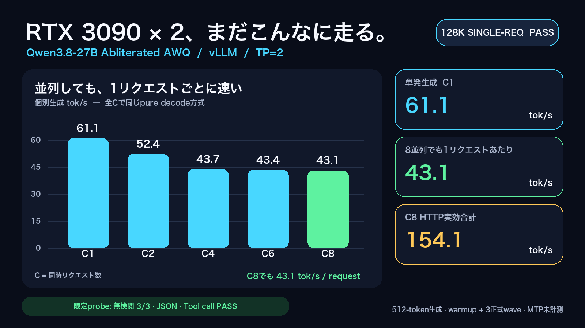
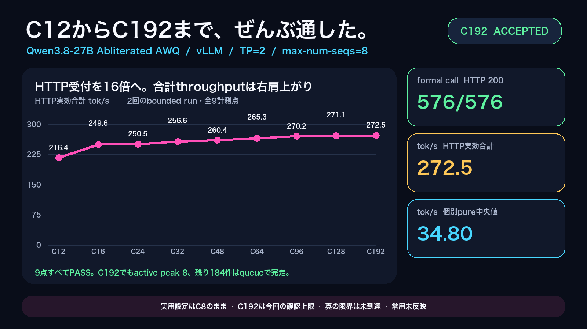
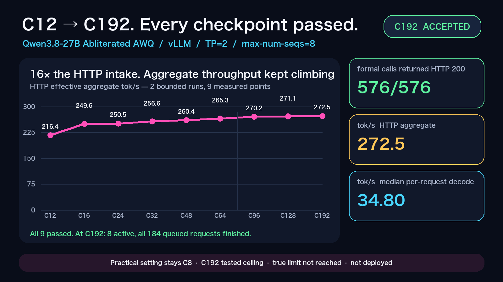
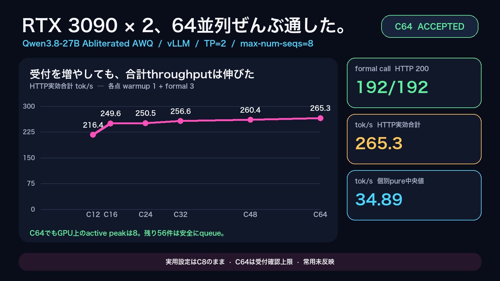
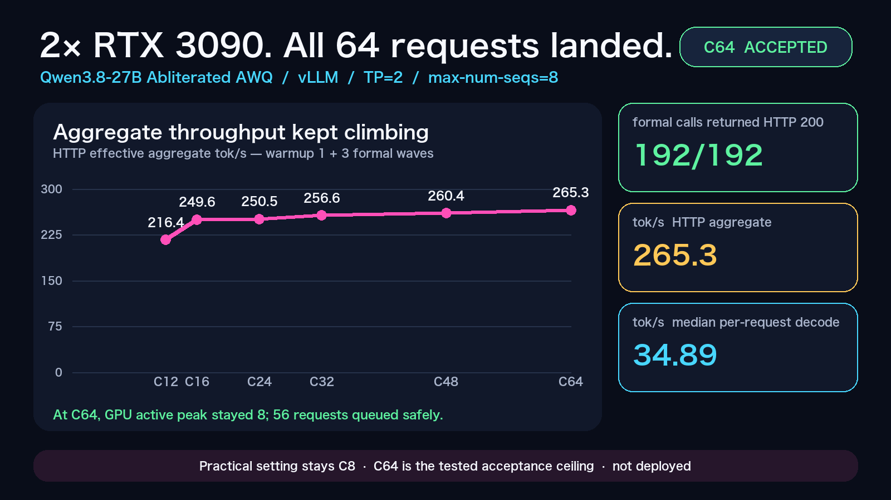

# Running Abliterated Qwen3.8-27B AWQ on Two RTX 3090s (vLLM TP=2)

## Overview

This recipe documents observed inference results for the abliterated Qwen3.8-27B AWQ artifact served with [vLLM](https://github.com/vllm-project/vllm) tensor parallelism (TP=2) across two NVIDIA RTX 3090 GPUs (24 GB each). It is a reproducibility guide and measurement record, not a model release or a weight-distribution mechanism.

The measured quantization artifact is [`twolven/Qwen3.8-27B-abliterated-AWQ-MTP`](https://huggingface.co/twolven/Qwen3.8-27B-abliterated-AWQ-MTP). The Hugging Face revision used in the 2026-08-31 benchmark wave was not recorded in the primary measurement report; verify the snapshot you download locally before serving. This repository does not redistribute model weights.

The documented engine is vLLM **0.27.1**. The baseline configuration measured here uses **MTP disabled** (no speculative decoding). A separate MTP3 + PIECEWISE candidate was not measured because FlashInfer compilation failed with a missing `ninja` binary; see [MTP not measured](#mtp-not-measured) below.

## Hardware and prerequisites

| Item | Documented configuration |
|---|---:|
| GPUs | 2x NVIDIA RTX 3090 (24 GB VRAM each) |
| Parallelism | vLLM TP=2 |
| Weight format | AWQ (`compressed-tensors`) |
| Engine | vLLM 0.27.1 |
| Context length | 131072 tokens |
| Max concurrent sequences | 8 (`--max-num-seqs 8`) |
| Max batched tokens | 4096 (`--max-num-batched-tokens 4096`, BTOK=4096) |
| GPU memory utilization | 0.70 |
| MTP / speculative decoding | Off (baseline) |

Before deployment, confirm compatible NVIDIA drivers, CUDA toolkit, and Python for vLLM 0.27.1 on your host. Driver and CUDA versions were not recorded in the primary benchmark report; check vLLM release notes and your `nvidia-smi` output locally.

You also need sufficient disk space for the Hugging Face snapshot, a Python virtual environment with vLLM 0.27.1, and no competing heavyweight GPU workload on both cards.

## Setup

### 1. Create a Python environment with vLLM 0.27.1

```bash
python3 -m venv <VENV_DIR>
source <VENV_DIR>/bin/activate
pip install "vllm==0.27.1"
vllm --version
```

Confirm the reported version is `0.27.1` before loading weights.

### 2. Download the model snapshot (do not redistribute)

Fetch the approved artifact from Hugging Face into `<MODEL_DIR>`. This recipe does not include weights.

```bash
# Example using the Hugging Face CLI; use any equivalent fetch method you trust.
huggingface-cli download twolven/Qwen3.8-27B-abliterated-AWQ-MTP \
  --local-dir <MODEL_DIR>
```

Record the revision or commit you actually downloaded. The 2026-08-31 wave did not publish a pinned revision in its report.

### 3. Optional: pin power limits

The measured host ran both GPUs at a 250 W power limit during the benchmark wave. Adjust with your platform tools if you want to match that condition; this is optional and host-specific.

## Launch recipe

Bind to localhost unless you deliberately expose the server behind your own reverse proxy or tunnel.

```bash
source <VENV_DIR>/bin/activate

vllm serve <MODEL_DIR> \
  --host 127.0.0.1 \
  --port <PORT> \
  --served-model-name qwen \
  --tensor-parallel-size 2 \
  --max-model-len 131072 \
  --gpu-memory-utilization 0.70 \
  --max-num-seqs 8 \
  --max-num-batched-tokens 4096 \
  --quantization compressed-tensors \
  --default-chat-template-kwargs '{"enable_thinking":false}' \
  --enable-auto-tool-choice \
  --tool-call-parser qwen3_coder \
  --reasoning-parser qwen3
```

Fixed baseline flags for comparisons with the measurements below:

- TP=2
- `max-model-len=131072`
- `max-num-seqs=8`
- `max-num-batched-tokens=4096` (BTOK=4096)
- MTP off (no `--speculative-config` / no draft model)

## Health check

After the server finishes loading, confirm the process is listening and responding:

```bash
curl -sS "http://127.0.0.1:<PORT>/health"
curl -sS "http://127.0.0.1:<PORT>/v1/models"
```

Expect HTTP 200 and a served model id of `qwen`.

## Smoke generation

```bash
curl -sS "http://127.0.0.1:<PORT>/v1/chat/completions" \
  -H "Content-Type: application/json" \
  -d '{
    "model": "qwen",
    "messages": [{"role": "user", "content": "Reply with only the number for 1+1."}],
    "max_tokens": 16,
    "temperature": 1.0,
    "top_p": 0.95
  }'
```

The benchmark wave used thinking off, `temperature=1.0`, `top_p=0.95`, `top_k=20`, `repetition_penalty=1.05`, and `max_tokens=512` for throughput tests.

## Measured results

These are observed results from the 2026-08-31 benchmark wave, not vendor projections. Two measurement methodologies are used and must not be treated as interchangeable:

1. **Individual pure decode (tok/s per request)** — per-call decode interval and that call's `completion_tokens`.
2. **HTTP wave wall aggregate (tok/s)** — `sum(completion_tokens) / wall-clock batch duration` for concurrent requests launched in one wave.

Do not compute speedup ratios between these two methodologies.

### Practical setting: HTTP C8, active sequence 8 (2026-08-31, Issue #97 confirmed)

| Item | Value |
|---|---|
| Model | Qwen3.8-27B Abliterated AWQ |
| Engine | vLLM 0.27.1 |
| Hardware | 2x RTX 3090 24GB, TP=2 |
| MTP | Off |
| Context length | 131072 |
| `max-num-seqs` | 8 |
| `max-num-batched-tokens` | 4096 |
| KV cache | Default (`auto`) |

| Metric | Methodology | Result |
|---|---|---:|
| HTTP effective total throughput | HTTP C8 wave wall aggregate | **250.957 tok/s** |
| Individual generation speed | C8 median pure decode per request | **36.350 tok/s** |

The launch flag `--max-num-seqs 8` corresponds to this setting. Even when more HTTP requests are admitted, active GPU sequences do not exceed 8; additional requests queue until a sequence slot frees.

### Maximum explored HTTP admission: C96 through C192 (2026-09-01, Issue #128 confirmed)

Fixed baseline: same model/engine/hardware as above, `max-num-seqs=8`, `max-num-batched-tokens=4096`, MTP off, ctx=131072, output 512 tokens per call. Each point: warmup 1 + formal 3 waves.

| HTTP C | All calls / formal | HTTP effective total (median tok/s) | Pure decode (median tok/s) | Formal batch TTFT (median s) | Max TTFT (s) | Active / waiting peak | Verdict |
|---:|---:|---:|---:|---:|---:|---|---|
| 96 | 384 / 288 | 270.219 | 34.866 | 74.204 | 154.077 | 8 / 88 | PASS |
| 128 | 512 / 384 | 271.100 | 34.822 | 98.411 | 204.560 | 8 / 120 | PASS |
| 192 | 768 / 576 | **272.467** | 34.804 | 148.537 | 306.113 | 8 / 184 | PASS — explored upper bound |

All calls returned HTTP 200 with zero client errors at every point. C192 completed warmup **768/768** and formal **576/576** calls successfully. C192 is the **maximum HTTP admission explored** in this ladder; it is not a proven implementation ceiling and the true admission failure point was not reached. Active GPU sequences remained capped at 8 at every point; up to 184 requests were waiting at C192. Concurrency above C192 (for example C256) was not measured. C192 does **not** mean 192 simultaneous GPU decode streams.

At all points: KV cache peak 13.91%, minimum GPU free memory 7687 MiB, no swap growth, and no HTTP/client/socket/FD/OOM/CUDA/NCCL/GPU errors were observed.

Full per-point data: [`data/http_concurrency_ladder_issue128_20260901.json`](data/http_concurrency_ladder_issue128_20260901.json).

### Historical measurement: C12 through C64 ladder (2026-09-01, Issue #109 — superseded by Issue #128)

An earlier ladder explored HTTP admission from C12 through C64 before the C96–C192 extension in Issue #128. These values are **historical** and superseded by the C192 confirmation above; do not treat C64 as the current explored upper bound.

| HTTP C | Formal calls | HTTP effective total (median tok/s) | Pure decode (median tok/s) | Formal batch TTFT (median s) | Max TTFT (s) | Active / waiting peak | Verdict |
|---:|---:|---:|---:|---:|---:|---|---|
| 12 | 36 | 216.370 | 35.702 | 0.449 | 14.939 | 8 / 4 | PASS |
| 16 | 48 | 249.563 | 35.501 | 4.595 | 15.181 | 8 / 8 | PASS |
| 24 | 72 | 250.495 | 35.384 | 15.182 | 29.926 | 8 / 16 | PASS |
| 32 | 96 | 256.625 | 35.161 | 18.205 | 44.645 | 8 / 24 | PASS |
| 48 | 144 | 260.376 | 34.901 | 30.893 | 70.960 | 8 / 40 | PASS |
| 64 | 192 | 265.349 | 34.887 | 46.281 | 98.401 | 8 / 56 | PASS |

Full per-point data: [`data/http_concurrency_ladder_20260901.json`](data/http_concurrency_ladder_20260901.json).

### Visualizations



The chart above is from the earlier **seqs=4** measurement wave. The C8 HTTP aggregate shown in that image (154.088 tok/s) is a **historical** value; see [Historical measurement](#historical-measurement-superseded-seqs4-config--do-not-use-as-current-recommendation) below. Do not treat it as the current recommended setting.

These two cards were updated on 2026-09-02 to a consolidated view spanning all nine measured points, C12 through C192, combining the Issue #109 and Issue #128 measurement waves in one chart with a vertical line marking the run boundary between them. Underlying numbers are unchanged from the tables above.





Historical single-run C64-only result cards (superseded by the consolidated C12–C192 card above):





### Historical measurement (superseded, seqs=4 config — do not use as current recommendation)

These values used `--max-num-seqs 4` and are **superseded**. They are not the current recommended launch flags.

| Metric | Concurrency | Methodology | Result |
|---|---:|---|---:|
| Individual generation speed | C1 (1 concurrent request) | pure decode per request | **61.1 tok/s** (61.1267 measured) |
| Individual generation speed | C8 (8 concurrent requests) | median pure decode per request | **43.1 tok/s** (43.115 measured) |
| HTTP effective total throughput | C8 | HTTP wave wall aggregate | **154.1 tok/s** (154.088 measured) |

C2/C4 aggregate values from an earlier aggregation formula were withdrawn and must not be cited.

### 131072-token admission (single request)

A single streaming request was admitted with chat-template tokenization adjusted to **131008 prompt tokens** and **`max_tokens=64`** (requested total 131072). Result: **PASS** (HTTP 200; `usage.prompt_tokens=131008`, `completion_tokens=26`).

This is a **single-request admission probe**, not a guarantee that all workloads or concurrency levels can sustain 128K context.

### Limited quality probes

Representative probes on the same baseline server:

| Probe | Result |
|---|---|
| Uncensored fixture (3 prompts) | refusal-pattern matched **0/3** |
| JSON-constrained prompt | JSON parse **PASS** (`{"answer":4}`) |
| Tool-call prompt | `get_weather` **PASS** with arguments `{"city":"東京"}` |

These are limited smoke checks, not a full safety or capability certification.

## Benchmark commands (generalized)

The primary report used a fixed prompt SHA-256 (`e1ec74f3e8a5970ba44223caf71bb57e7e70dcd7ca77feabb2293cf9fc6aca0a`), warmup plus three formal batches per concurrency level, and concurrent HTTP clients. Reproduce with your own harness; keep methodologies separated.

**Individual pure decode** — for each completed request, compute `(completion_tokens - 1) / (last_content_timestamp - first_content_timestamp)` from streamed chunks.

**HTTP wave wall aggregate** — for a batch of `C` concurrent requests launched together, compute `sum(completion_tokens) / (batch_end - batch_start)` using wall-clock time covering the whole wave.

Example single-client timing check (not a full benchmark harness):

```bash
# Replace with your streaming client that records first/last content timestamps.
python3 <YOUR_BENCH_CLIENT>.py \
  --url "http://127.0.0.1:<PORT>/v1/chat/completions" \
  --model qwen \
  --concurrency 1 \
  --max-tokens 512
```

## MTP not measured

An MTP3 + PIECEWISE configuration was attempted after the baseline wave. FlashInfer compilation failed with `FileNotFoundError: ninja`. No dependency install, download, or retry was performed for that path in the measured run. MTP acceptance rates and MTP speed are **unknown**. Treat MTP as an optional future verification item only; this recipe makes no speed-up claim for MTP.

## Stopping the server

Identify the vLLM API server parent process and stop it gracefully:

```bash
# Find the listener (example)
ss -H -ltnp "sport = :<PORT>"

# Send SIGTERM to the vLLM parent PID you verified
kill -TERM <PID>

# Wait until the port is free; escalate only if the process survives
while ss -H -ltnp "sport = :<PORT>" | grep -q .; do sleep 2; done
```

If child worker processes remain, terminate the parent first; avoid killing unrelated GPU jobs. Confirm both GPUs release memory with `nvidia-smi`.

## Recovery and rollback

1. **Graceful restart** — stop the server as above, then relaunch the [fixed baseline command](#launch-recipe).
2. **Configuration rollback** — if you changed launch flags, restore the last known-good command line from your own notes or process manager config, then restart.
3. **Model rollback** — if you tested another snapshot, switch `<MODEL_DIR>` back to the verified baseline snapshot and restart.
4. **Post-recovery checks** — `/health` returns 200, `/v1/models` lists `qwen`, and a short smoke completion succeeds.

## Known pitfalls and troubleshooting

1. **Do not mix measurement methodologies.** Per-request pure decode and HTTP wave wall aggregate answer different questions; never compare them with a single speedup ratio.
2. **Do not cite withdrawn C2/C4 aggregate numbers.** Only per-request pure-decode values are valid for C2/C4.
3. **Do not conflate HTTP concurrency with active GPU sequences.** The confirmed practical setting is HTTP C8 / active sequence 8. HTTP admission was explored up to C192 (formal 576/576 calls PASS, 0 client errors) with active sequences still capped at 8 and up to 184 requests queued; C192 is a confirmed explored upper bound, not a proven implementation ceiling, and is not the recommended everyday setting. C256 and above were not measured.
4. **128K admission is a single-request probe.** Do not describe it as full-context guarantee for all traffic patterns.
5. **Check free memory and swap before loading.** Abort or reduce concurrency if swap grows unexpectedly during load or benchmark waves.
6. **Do not overlap heavyweight GPU work.** Avoid simultaneous large downloads, second model loads, or unrelated training jobs on the same GPUs.
7. **Verify tool and JSON probes locally** after any change to parsers (`qwen3_coder`, `qwen3` reasoning parser) or chat-template kwargs.
8. **MTP requires separate validation.** Missing build tools (for example `ninja`) can fail FlashInfer compilation; fix the build environment before attempting MTP, and measure independently.

## Credits and License

- The measured quantization artifact is credited to [twolven](https://huggingface.co/twolven) and [`twolven/Qwen3.8-27B-abliterated-AWQ-MTP`](https://huggingface.co/twolven/Qwen3.8-27B-abliterated-AWQ-MTP). Verify the applicable model license on Hugging Face before use.
- The underlying Qwen model family is credited to the original model authors. Verify upstream license terms separately.
- The serving engine is [vLLM](https://github.com/vllm-project/vllm); verify the applicable engine license from its upstream source.
- Benchmark measurements cited here come from model-lab PR #94 (`reports/out/3090_qwen38_speed_wave_20260831_0620/report.md`, 2026-08-31).
- HTTP concurrency ladder measurements (C8 practical, C12–C64 historical admission, C96–C192 admission) additionally come from model-lab Issue #97 (`reports/out/3090_qwen38_parallel_issue97_20260831/report.md`, PR #110), Issue #109 (`reports/out/3090_qwen38_http_issue109_20260901/report.md`, PR #126), and Issue #128 (`reports/out/3090_qwen38_http_issue128_20260901/report.md`, PR #131), all merged to `main`.
- The consolidated C12–C192 result cards above come from model-lab PR #134 (chart-only update, no new measurement data), merged to `main` on 2026-09-02.

This recipe documentation does not redistribute model weights. Select a documentation license before public release if you fork this README.
